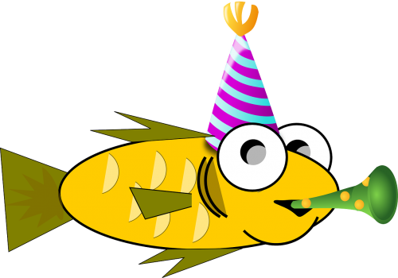

# `image` 和 `figure`

(content-blocks-images)=
## `image`

MyST Markdown 为在文档中包含图像提供了几种不同的语法，如下所述。

第一个是标准的 Markdown 语法

```md

```

结果是


这将正确地将图像复制到构建文件夹，并将其呈现在所有输出格式(HTML, TeX 等)。但是，它在可应用的配置中受到限制。例如，图像宽度不能用此语法设置。

正如在 [本节](content:myst/directives) 中讨论的，myst 允许使用诸如 `image` 和 `figure` 等指令(参见 [Sphinx文档](sphinx:rst-primer) 以获得可用选项)。

作为一个例子，

````md
```{image} ../images/fun-fish.png
:alt: fishy
:class: bg-primary mb-1
:width: 200px
:align: center
```
````

将包括以下_定制_图：

```{image} ../images/fun-fish.png
:alt: fishy
:class: bg-primary mb-1
:width: 200px
:align: center
```

这些指令允许您使用 [指令参数](directive-arguments) 控制图像的各个方面。

(figures:raw-html)=
### 原始 HTML 图片

上面描述的图像语法为您提供了更多的可定制性，但请注意，这种语法不会在常见的 Markdown 查看器中显示图像(例如，当文件在 GitHub 上查看时)。

解决方法是直接使用 HTML, MyST 可以通过扩展名 `html_image` 直接解析 HTML 图像。

:::{warning}
使用原始 HTML 通常是一个糟糕的选择(见 [此解释](raw-html-in-markdown))，所以在这样做之前要小心！
:::

要解析原始 HTML 图像语法，请在 `_config.yml` 中启用扩展 `html_image`：

```yaml
parse:
  myst_enable_extensions:
    # 不要忘记列出任何其他你想要启用的扩展，
    # 包括那些默认启用的！
    - html_image
```

HTML 图像将像其他图像一样被解析。例如：

```html

```

将正确的渲染


这也将输出在 PDF LaTeX 构建！

允许的属性等价于 `image` 指令：`src`, `alt`, `class`,` width` 和 `height`。任何其他属性将被忽略。

(content-blocks-images/formats)=
### 图像格式支持

HTML 和 LaTeX/PDF 输出格式都支持标准的栅格化图像格式，如 `.png` 和 `.jpg`。相比之下，向量格式，如 `.svg`、`.pdf` 和 `.eps` 通常是特定于 [构建器](sphinx:builders) 的。请参阅每个 Sphinx 构建器的 `supported_image_types` 规范。

为了支持多个构建器，Jupyter Book 允许你使用 `*` 星号作为扩展。例如，使用 HTML

```html

```

然后将搜索所有匹配所提供模式的图像，每个构建器从可用的候选图像中选择最佳图像。

上面的代码产生了下面的图像：


您可以使用 [imagemagick](https://imagemagick.org) 等工具，在构建图书之前将图像转换为多种格式。

或者，你也可以看看这些 Sphinx 扩展：

- [sphinx.ext.imgconverter](sphinx:sphinx.ext.imgconverter)
- [sphinxcontrib-svg2pdfconverter](https://github.com/missinglinkelectronics/sphinxcontrib-svg2pdfconverter)

## `figure`

MyST Markdown 也允许你在页面中包含 **`<figure>`**。就像图像一样，除了它们更容易在你的书的其他地方引用，它们包括像标题这样的东西。要包含一个 `<figure>`，请使用以下语法：

````md
```{figure} ../images/C-3PO_droid.png
---
height: 150px
name: directive-fig
---
Here is my figure caption!
```
````

这将产生以下内容：

```{figure} ../images/C-3PO_droid.png
---
height: 150px
name: directive-fig
---
Here is my figure caption!
```

:::{note}
您还可以在笔记本中包含由您的代码生成的数字。要这样做，看 [](content:code-outputs:glue).
:::

## Markdown figures

Markdown figures 结合 [colon 风格的 admonitions](admonitions:colons) 和 [HTML 图像解析](figures:raw-html)，生成了一个 “Markdown友好” 的 figures 语法，与上面的 `figure` 指令具有相同的行为。

:::{note}
使用此特性需要 [启用 HTML 图像解析](figures:raw-html)。
:::

图形块必须**只**包含两个组件；Markdown 或 HTML 语法的图片，以及一个单独的段落作为标题。请看下面的例子。

与 admonition 一样，figure 可以设置其他类。admonition 的“标题”被用作标签，可以作为交叉引用的目标。

例如，代码

```md
:::{figure-md} markdown-fig


This is a caption in **Markdown**!
:::
```

生成这个图：

:::{figure-md} markdown-fig


This is a caption in **Markdown**!
:::

正如我们在这里看到的，我们可以参考这个图：

[Go to the fish!](markdown-fig)

我们只需要把这句提示的标题作为目标：

```md
[Go to the fish!](markdown-fig)
```

(figures:referencing)=
## 引用图形

然后，您可以使用 `{ref}` 角色或 Markdown 样式引用您的图形，如：

```md
- {ref}`directive-fig`
- [](markdown-fig)
```

它将用下图标题代替引用，如下所示：

- {ref}`directive-fig`
- [](markdown-fig)

(figures:numref)=
### 引用编号

创建交叉引用的另一种方便方法是使用 `{numref}` 角色，该角色通过自动获取的数字引用带标签的对象。例如，`` {numref}`directive-fig` `` 将产生如下引用：{numref}`directive-fig`。

如果提供了显式文本，则此标题将作为引用的标题。例如，

```md
- {ref}`Fly to the droid <directive-fig>`
- [Swim to the fish](markdown-fig)
```

生成以下交叉引用：

- {ref}`Fly to the droid <directive-fig>`
- [Swim to the fish](markdown-fig)

使用 `numref`，您还可以单独访问数字和标题：序列 "%s" 和 "{number}" 将被替换为数字，而 "{name}" 将被替换为数字标题。

例如，``{numref}`Figure {number}: {name} <directive-fig>` `` 将生成 {numref}`Figure {number}: {name} <directive-fig>`。

## Margin captions and figures

你可以使用 `:figclass: margin-caption` 在页边距添加一个图说明，如 {numref}`margin_caption_figure` 所示：

```{figure} ../images/cool.jpg
---
height: 150px
figclass: margin-caption
name: margin_caption_figure
---
Here is my figure caption!
```

另一种选择是使用 `:figclass: margin` (如 {numref}`margin_figure` 所示)在页边距中包含图形：

```{figure} ../images/cool.jpg
---
width: 60%
figclass: margin
name: margin_figure
---
Here is my figure caption!
```

## 图形缩放和对齐

图形也可以使用 `:align: right` 或 `:align: left` 选项来对齐。默认情况下，图形对齐到中心(见 {numref}`directive-fig`)。

要使一个图形在左边对齐，你需要写

````md
```{figure} ../images/cool.jpg
---
scale: 50%
align: left
---
Here is my figure caption!
```
````

得到

```{figure} ../images/cool.jpg
---
scale: 50%
align: left
---
Here is my figure caption!
```

类似地，如果你写

````md
```{figure} ../images/cool.jpg
---
scale: 50%
align: right
---
Here is my figure caption!
```
````

你的图形右对齐:

```{figure} ../images/cool.jpg
---
scale: 50%
align: right

---
Here is my figure caption!
```

## Figure 参数

支持以下选项：

`scale` : _整数百分比_
:  均匀地缩放图形。默认值是“100”，表示没有伸缩性。符号“%”是可选的。

`width` : _长度或百分_
:  您可以以下单位设置图形宽度："em", "ex", "px","in" ,"cm", "mm", "pt", "pc", "%".

`height` : _长度_
:  您可以以下单位设置图形高度："em", "ex", "px", "in", "cm", "mm", "pt", "pc".

`alt` : _文本_
:  如果无法显示图形或读者正在使用辅助技术，则将显示文本。通常需要对图形进行简短的描述。

`align` : _"left", "center", 或 "right"_
:  使图形左、中、右对齐。默认对齐方式为居中对齐。

`name` : _文本_
:  您的图形的唯一标识符，您可以使用 `{ref}` 或 `{numref}` 角色来引用它。不能包含空格或特殊字符。

`figclass` : _文本_
:  值的图像类属性，可以用来添加自定义 CSS 或 JavaScript。预定义的选项包括：

  * _"margin"_ : 在空白处显示图形
  * _"margin-caption"_ : 在空白处显示图形字幕
