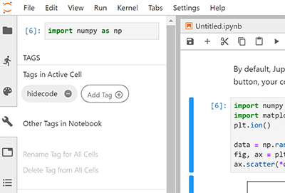

# 将元数据添加到您的书籍页面

元数据是关于一本书或其内容的信息。它经常被用来控制 Jupyter Book 及其特性的行为。这是一个简短的指南，介绍如何将元数据添加到 Jupyter Book 的各种内容中。

(jupyter-cell-tags)=
## 将元数据添加到笔记本

您可以通过在单元格元数据中放置自定义标记来控制 Jupyter Book 的行为。这允许您 {doc}`自动隐藏代码单元格 <../interactive/hiding>` 以及 [向单元格添加交互式小部件](launch:thebe)。

### 使用笔记本界面添加标签

有两种简单的方法可以将元数据添加到单元格中：

1. **使用 Jupyter Notebook 单元格标签编辑器**. 默认情况下，Jupyter Notebook 附带一个单元格标记编辑器。这允许您快速地向每个单元格添加单元格标记。

   要启用单元格标签编辑器，单击 `View -> Cell Toolbar -> Tags`。这将启用标签 UI。菜单是这样的。

   

2. **使用 JupyterLab Cell Tags 插件**。JupyterLab 是一个类似 IDE 的 Jupyter 环境，可以在浏览器中运行。它有一个内置的“单元格标签”插件，它公开了一个用户界面，允许您快速插入单元格标签。

   您将在"wrench"菜单部分找到标签。
   以下是 JupyterLab 中的标签 UI。

   

标签实际上只是单元级元数据的一个特殊部分。元数据有三种级别:

* 对于笔记本级别：在 Jupyter 笔记本工具栏上转到 `Edit -> Edit Notebook Metadata`
* 对于单元格级别：在 Jupyter 笔记本工具栏中，点击 `View -> Cell Toolbar -> Edit Metadata`，每个单元格上方都会出现一个按钮。
* 对于输出级别：使用如 `IPython.display.display(obj,metadata={"tags": [])`，你可以设置特定于某个输出的元数据(但是 Jupyter Book 还没有利用这一点)。


### 使用 MyST Markdown 笔记本添加标签

如果你正在用 MyST Markdown 写笔记本，那么当你写 `{code-cell}` 块时，你可以添加标签到每个代码单元格。例如，下面我们:

````
```{code-cell}
:tags: [tag1,tag2,tag3]
print("some code")
```
````

将创建一个带有这三个标签的代码单元格。有关 MyST Markdown 笔记本的更多信息，请参阅 [](../file-types/myst-notebooks.md)。

### 使用 Python 代码添加标记

有时您希望快速扫描笔记本的单元格，以便根据单元格的内容添加标记。例如，您可能希望使用 `remove-input` 标记隐藏任何包含 import 语句的单元格。

下面是一个简短的 Python 代码片段，可以实现类似于此的功能。首先将目录更改到图书文件夹的根目录，然后将下面的脚本作为Python脚本或在 Jupyter Notebook 中运行(根据用例进行必要的修改)。最后，检查将要做出的更改并将它们提交到存储库。

```python
import nbformat as nbf
from glob import glob

# Collect a list of all notebooks in the content folder
notebooks = glob("./content/**/*.ipynb", recursive=True)

# Text to look for in adding tags
text_search_dict = {
    "# HIDDEN": "remove-cell",  # Remove the whole cell
    "# NO CODE": "remove-input",  # Remove only the input
    "# HIDE CODE": "hide-input"  # Hide the input w/ a button to show
}

# Search through each notebook and look for the text, add a tag if necessary
for ipath in notebooks:
    ntbk = nbf.read(ipath, nbf.NO_CONVERT)

    for cell in ntbk.cells:
        cell_tags = cell.get('metadata', {}).get('tags', [])
        for key, val in text_search_dict.items():
            if key in cell['source']:
                if val not in cell_tags:
                    cell_tags.append(val)
        if len(cell_tags) > 0:
            cell['metadata']['tags'] = cell_tags

    nbf.write(ntbk, ipath)
```

## 向笔记本单元格添加元数据

标签之类的东西
